# Optical Flow Prediction with Tensorflow

This repo provides a TensorFlow-based implementation of the wonderful paper "PWC-Net: CNNs for Optical Flow Using Pyramid, Warping, and Cost Volume," by Deqing Sun et al. (CVPR 2018).

There are already a few attempts at implementing PWC-Net using TensorFlow out there. However, they either use outdated architectures of the paper's CNN networks, only provide TF inference (no TF training), only work on Linux platforms, and do not support multi-GPU training.

This implementation provides **both TF-based training and inference**. It is **portable**: because it doesn't use any dynamically loaded CUDA-based TensorFlow user ops, it **works on Linux and Windows**. It also **supports multi-GPU training** (the notebooks and results shown here were collected on a GTX 1080 Ti paired with a Titan X). The code also allows for **mixed-precision training**.

Finally, as shown in the ["Links to pre-trained models"](#links) section, we achieve better results than the ones reported in the official paper on the challenging MPI-Sintel 'final' dataset.

# Table of Contents

- [Background](#background)
- [Environment Setup](#environment-setup)
- [Links to pre-trained models](#links)
- [PWC-Net](#pwc-net)
  + [Basic Idea](#pwc-net-basic-idea)
  + [Network](#pwc-net-network)
  + [Jupyter Notebooks](#pwc-net-jupyter-notebooks)
  + [Training](#pwc-net-training)
    * [Multisteps learning rate schedule](#pwc-net-training-multisteps)
    * [Cyclic learning rate schedule](#pwc-net-training-cyclic)
    * [Mixed-precision training](#pwc-net-training-mixed-precision)
  + [Evaluation](#pwc-net-eval)
- [Datasets](#datasets)
- [References](#references)
- [Acknowledgments](#acknowledgments)

# Background

The purpose of **optical flow estimation** is to generate a dense 2D real-valued (u,v vector) map of the motion occurring from one video frame to the next. This information can be very useful when trying to solve computer vision problems such as **object tracking, action recognition, video object segmentation**, etc.

Figure [[2017a]](#2017a) (a) below shows training pairs (black and white frames 0 and 1) from the [Middlebury](http://vision.middlebury.edu/flow/) Optical Flow dataset as well as the their color-coded optical flow ground truth. Figure (b) indicates the color coding used for easy visualization of the (u,v) flow fields. Usually, vector orientation is represented by color hue while vector length is encoded by color saturation:

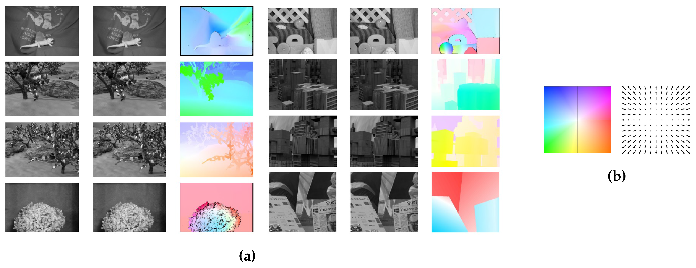

The most common measures used to evaluate the quality of optical flow estimation are **angular error (AE)** and **endpoint error (EPE)**. The angular error between two optical flow vectors *(u<sub>0</sub>, v<sub>0</sub>)* and *(u<sub>1</sub>, v<sub>1</sub>)* is defined as *arccos((u<sub>0</sub>, v<sub>0</sub>) . (u<sub>1</sub>, v<sub>1</sub>))*. The endpoint error measures the distance between the endpoints of two optical flow vectors *(u<sub>0</sub>, v<sub>0</sub>)* and *(u<sub>1</sub>, v<sub>1</sub>)* and is defined as *sqrt((u<sub>0</sub> - u<sub>1</sub>)<sup>2</sup> + (v<sub>0</sub> - v<sub>1</sub>)<sup>2</sup>)*.


# Environment Setup <a name="environment-setup"></a>

The code in this repo was developed and tested using Anaconda3 v.5.2.0. To reproduce our conda environment, please refer to the following files:

*On Ubuntu:*
- [`conda list`](tfoptflow/setup/dlubu36.txt) and [`conda env export`](tfoptflow/setup/dlubu36.yml)

*On Windows:*
- [`conda list`](tfoptflow/setup/dlwin36.txt) and [`conda env export`](tfoptflow/setup/dlwin36.yml)

# Links to pre-trained models <a name="links"></a>

Pre-trained models can be found [here](http://bit.ly/tfoptflow). They come in two flavors: "small" (`sm`, with 4,705,064 learned parameters) models don't use dense connections or residual connections, "large" (`lg`, with 14,079,050 learned parameters) models do. They are all built with a 6-level pyramid, upsampling level 2 by 4 in each dimension to generate the final prediction, and construct an 81-channel cost volume at each level from a search range (maximum displacement) of 4.

Please note that we trained these models using slightly different dataset and learning rate schedules. The official multistep schedule discussed in [[2018a]](#2018a) is as follows: S<sub>long</sub> 1.2M iters training, batch size 8 + S<sub>fine</sub> 500k iters finetuning, batch size 4). Ours is S<sub>long</sub> only, 1.2M iters, batch size 8, on a mix of `FlyingChairs` and `FlyingThings3DHalfRes`. `FlyingThings3DHalfRes` is our own version of `FlyingThings3` where every input image pair and groundtruth flow has been **downsampled by two** in each dimension. We also use a **different set of augmentation techniques**.

| Model name | Notebooks | FlyingChairs (384x512) AEPE | Sintel clean (436x1024) AEPE | Sintel final (436x1024) AEPE |
| :---: | :---: | :---: | :---: | :---: |
| `pwcnet-lg-6-2-multisteps-chairsthingsmix` | [train](tfoptflow/pwcnet_train_lg-6-2-multisteps-chairsthingsmix.ipynb) | 1.44 ([notebook](tfoptflow/pwcnet_eval_lg-6-2-multisteps-chairsthingsmix_flyingchairs.ipynb)) | 2.60 ([notebook](tfoptflow/pwcnet_eval_lg-6-2-multisteps-chairsthingsmix_mpisintelclean.ipynb)) | 3.70 ([notebook](tfoptflow/pwcnet_eval_lg-6-2-multisteps-chairsthingsmix_mpisintelfinal.ipynb)) |
| `pwcnet-sm-6-2-multisteps-chairsthingsmix` | [train](tfoptflow/pwcnet_train_sm-6-2-multisteps-chairsthingsmix.ipynb) | 1.72 ([notebook](tfoptflow/pwcnet_eval_sm-6-2-multisteps-chairsthingsmix_flyingchairs.ipynb)) | 2.93 ([notebook](tfoptflow/pwcnet_eval_sm-6-2-multisteps-chairsthingsmix_mpisintelclean.ipynb)) | 3.89 ([notebook](tfoptflow/pwcnet_eval_sm-6-2-multisteps-chairsthingsmix_mpisintelfinal.ipynb)) |

As a reference, here are the official, reported results:


We also measured the following MPI-Sintel (436 x 1024) inference times on a few GPUs:

| Model name |  Titan X  |  GTX 1080  |  GTX 1080 Ti  |
| :---: | :---: | :---: | :---: |
| `pwcnet-lg-6-2-cyclic-chairsthingsmix` | 90ms | 81ms | 68ms |
| `pwcnet-sm-6-2-cyclic-chairsthingsmix` | 68.5ms | 64.4ms | 53.8ms |


# PWC-Net <a name="pwc-net"></a>

## Basic Idea <a name="pwc-net-basic-idea"></a>

Per [[2018a]](#2018a), PWC Net improves on FlowNet2 [[2016a]](#2016a) by adding domain knowledge into the design of the network. The basic idea behind optical flow estimation it that a pixel will retain most of its brightness over time despite a positional change from one frame to the next ("brightness" constancy). We can grab a small patch around a pixel in video frame 1 and find another small patch in video frame 2 that will maximize some function (e.g., normalized cross correlation) of the two patches. Sliding that patch over the entire frame 1, looking for a peak, generates what's called a **cost volume** (the C in PWC). This techniques is fairly robust (invariant to color change) but is expensive to compute. In some cases, you may need a fairly large patch to reduce the number of false positives in frame1, raising the complexity even more.

To alleviate the cost of generating the cost volume, the first optimization is to use **pyramidal processing** (the P in PWC). Using a lower resolution image lets you perform the search sliding a smaller patch from frame 1 over a smaller version of frame 2, yielding a smaller motion vector, then use that information as a hint to perform a more targeted search at the next level of resolution in the pyramid. That multiscale motion estimation can be performed in the image domain or in the feature domain (i.e., using the downscaled feature maps generated by a convnet). In practice, PWC **warps** (the W in PWC) frame 1 using an upsampled version of the motion flow estimated at a lower resolution because this will lead to searching for a smaller motion increment in the next higher resolution level of the pyramid (hence, allowing for a smaller search range). Here's a screenshot of a [talk](https://www.youtube.com/watch?v=vVU8XV0Ac_0) given by [Deqing Sun](http://research.nvidia.com/person/deqing-sun) that illustrates this process using a 2-level pyramid:

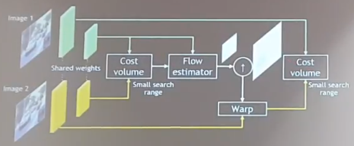

Note that none of the three optimizations used here (P/W/C) are unique to PWC-Net. These are techniques that were also used in SpyNet [[2016b]](#2016b) and FlowNet2 [[2016a]](#2016a). However, here, they are used **on the CNN features**, rather than on an image pyramid:


The authors also acknowledge the fact that careful data augmentation (e.g., adding horizontal flipping) was necessary to reach best performance. To improve robustness, the authors also recommend training on multiple datasets (Sintel+KITTI+HD1K, for example) with careful class imbalance rebalancing.

Since this algorithm only works on two continuous frames at a time, it has the same limitations as methods that only use image pairs (instead of n frames with n>2). Namely, if an object moves out of frame, the predicted flow will likely have a large EPE. As the authors remark, techniques that use a larger number of frames can accommodate for this limitation by propagating motion information over time. The model also sometimes fails for small, fast moving objects.


## Network <a name="pwc-net-network"></a>

Here's a picture of the network architecture described in [[2018a]](#2018a):

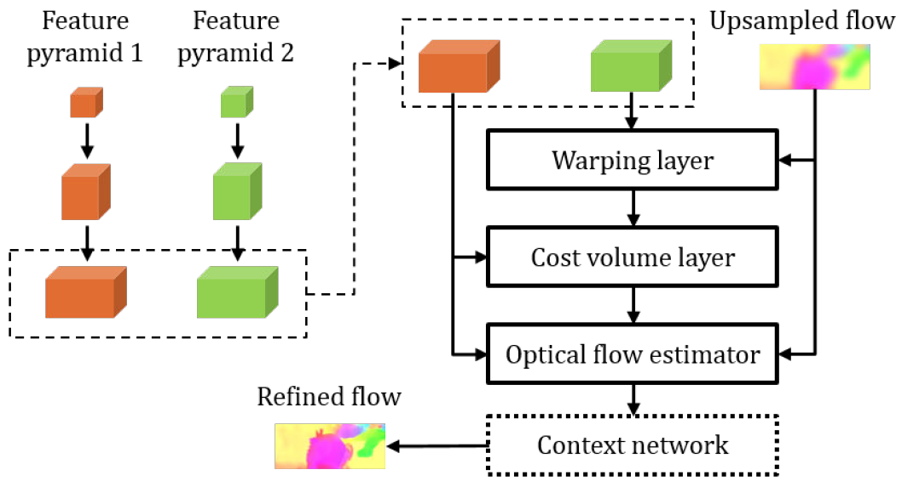

## Jupyter Notebooks <a name="pwc-net-jupyter-notebooks"></a>

The recommended way to test this implementation is to use the following Jupyter notebooks:

- [`Optical flow datasets (prep and inspect)`](tfoptflow/dataset_prep.ipynb): In this notebook, we:
  + Load the optical flow datasets and (automatically) create the additional data necessary to train our models (one-time operation on first-time load).
  + Show sample images/flows from each dataset. Note that you must have downloaded and unpacked the master data files already. See [[Datasets]](#datasets) for download links to each dataset.

- [`PWC-Net-large model training (with multisteps learning rate schedule)`](tfoptflow/pwcnet_train_lg-6-2-multisteps-chairsthingsmix.ipynb): In this notebook, we:
  + Use a PWC-Net-large model (with dense and residual connections), 6 level pyramid, upsample level 2 by 4 as the final flow prediction
  + Train the model on a mix of the `FlyingChairs` and `FlyingThings3DHalfRes` dataset using the S<sub>long</sub> schedule described in [[2016a]](#2016a)
  + In [`PWC-Net-small model training (with multisteps learning rate schedule)`](tfoptflow/pwcnet_train_sm-6-2-multisteps-chairsthingsmix.ipynb), we train the small version of the model (no dense or residual connections)
  + In [`PWC-Net-large model training (with cyclical learning rate schedule)`](tfoptflow/pwcnet_train_lg-6-2-cyclic-chairsthingsmix.ipynb), we train the large version of the model using the Cyclic<sub>short</sub> schedule
  + In [`PWC-Net-small model training (with cyclical learning rate schedule)`](tfoptflow/pwcnet_train_sm-6-2-cyclic-chairsthingsmix.ipynb), we train the small version of the model (no dense or residual connections) using the Cyclic<sub>short</sub> schedule

- [`PWC-Net-large model evaluation (on FlyingChairs validation split)`](tfoptflow/pwcnet_eval_lg-6-2-multisteps-chairsthingsmix_flyingchairs.ipynb): In this notebook, we:
  + Evaluate the PWC-Net-large model trained on a mix of the `FlyingChairs` and `FlyingThings3DHalfRes` datasets using the S<sub>long</sub> schedule
  + Run the evaluation on the **validation split** of the `FlyingChairs` dataset, yielding an average EPE of 1.44
  + Perform basic error analysis

- [`PWC-Net-large model evaluation (on MPI-Sintel 'clean')`](tfoptflow/pwcnet_eval_lg-6-2-multisteps-chairsthingsmix_mpisintelclean.ipynb): In this notebook, we:
  + Evaluate the PWC-Net-large model trained on a mix of the `FlyingChairs` and `FlyingThings3DHalfRes` datasets using the S<sub>long</sub> schedule
  + Run the evaluation on the **'clean'** version of the MPI-Sintel dataset, yielding an average EPE of 2.60
  + Perform basic error analysis

- [`PWC-Net-large model evaluation (on MPI-Sintel 'final')`](tfoptflow/pwcnet_eval_lg-6-2-multisteps-chairsthingsmix_mpisintelfinal.ipynb): In this notebook, we:
  + Evaluate the PWC-Net-large model trained on a mix of the `FlyingChairs` and `FlyingThings3DHalfRes` datasets using the S<sub>long</sub> schedule
  + Run the evaluation on the **'final'** version of the MPI-Sintel dataset, yielding an average EPE of 3.70
  + Perform basic error analysis

## Training <a name="pwc-net-training"></a>


### Multisteps learning rate schedule <a name="pwc-net-training-multisteps"></a>

Differently from the original paper, we do not train on `FlyingChairs` and `FlyingThings3D` sequentially (i.e, pre-train on `FlyingChairs` then finetune on `FlyingThings3D`). This is because the average flow magnitude on the `MPI-Sintel` dataset is only 13.5, while the average flow magnitudes on `FlyingChairs` and `FlyingThings3D` are 11.1 and 38, respectively. In our experiments, finetuning on `FlyingThings3D` would only yield worse results on `MPI-Sintel`.

We got more stable results by using a half-resolution version of the `FlyingThings3D` dataset with an average flow magnitude of 19, much closer to `FlyingChairs` and `MPI-Sintel` in that respect. We then trained on a mix of the `FlyingChairs` and `FlyingThings3DHalfRes` datasets. This mix, of course, could be extended with additional datasets.

Here are the training curves for the S<sub>long</sub> training notebooks listed above:

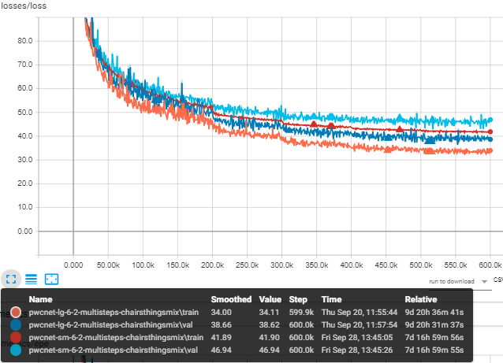
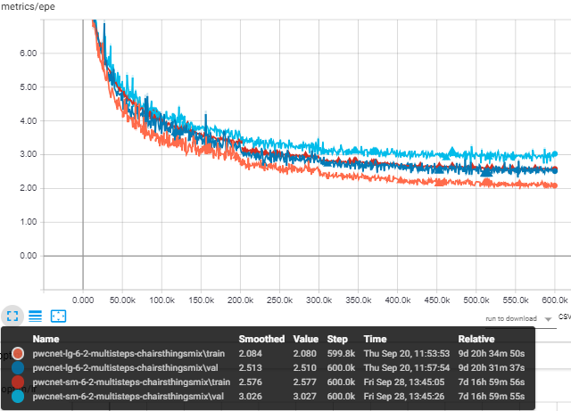
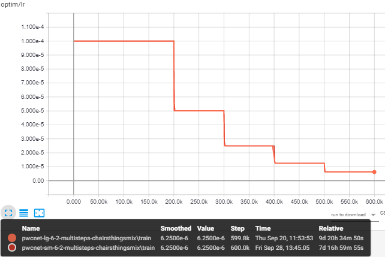

Note that, if you click on the `IMAGE` tab in Tensorboard while running the training notebooks above, you will be able to visualize the progress of the training on a few validation samples (including the predicted flows at each pyramid level), as demonstrated here:

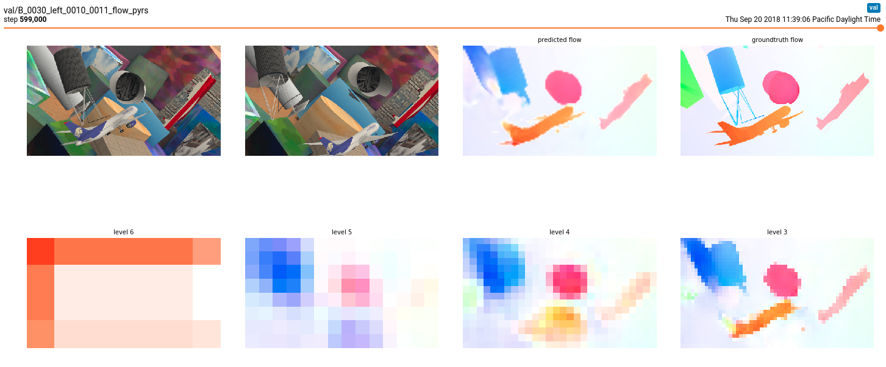
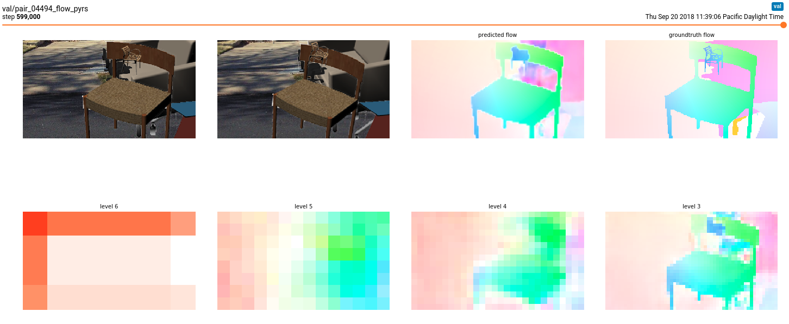

### Cyclic learning rate schedule <a name="pwc-net-training-cyclic"></a>

If you don't want to use the long training schedule, but still would like to play with this code, try our very short **cyclic learning rate schedule** (100k iters, batch size 8). The results are nowhere near as good, but they allow **for quick experimentation**:

| Model name | Notebooks | FlyingChairs (384x512) AEPE | Sintel clean (436x1024) AEPE | Sintel final (436x1024) AEPE |
| :---: | :---:| :---: | :---: | :---: |
| `pwcnet-lg-6-2-cyclic-chairsthingsmix` | [train](tfoptflow/pwcnet_train_lg-6-2-cyclic-chairsthingsmix.ipynb) | 2.67 ([notebook](tfoptflow/pwcnet_eval_lg-6-2-cyclic-chairsthingsmix_flyingchairs.ipynb)) | 3.99 ([notebook](tfoptflow/pwcnet_eval_lg-6-2-cyclic-chairsthingsmix_mpisintelclean.ipynb)) | 5.08 ([notebook](tfoptflow/pwcnet_eval_lg-6-2-cyclic-chairsthingsmix_mpisintelfinal.ipynb)) |
| `pwcnet-sm-6-2-cyclic-chairsthingsmix` | [train](tfoptflow/pwcnet_train_sm-6-2-cyclic-chairsthingsmix.ipynb) | 2.79 ([notebook](tfoptflow/pwcnet_eval_sm-6-2-cyclic-chairsthingsmix_flyingchairs.ipynb)) | 4.34 ([notebook](tfoptflow/pwcnet_eval_sm-6-2-cyclic-chairsthingsmix_mpisintelclean.ipynb)) | 5.3 ([notebook](tfoptflow/pwcnet_eval_sm-6-2-cyclic-chairsthingsmix_mpisintelfinal.ipynb))|

Below are the training curves for the Cyclic<sub>short</sub> training notebooks:


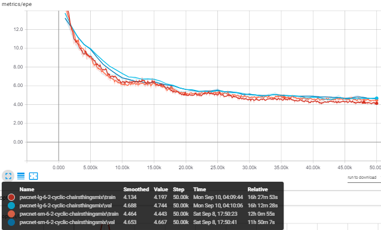
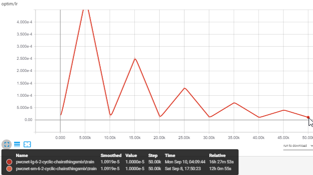

### Mixed-precision training <a name="pwc-net-training-mixed-precision"></a>

You can speed up training even further by using **mixed-precision** training. But, again, don't expect the same level of accuracy:

| Model name | Notebooks | FlyingChairs (384x512) AEPE | Sintel clean (436x1024) AEPE | Sintel final (436x1024) AEPE |
| :---: | :---:| :---: | :---: | :---: |
| `pwcnet-sm-6-2-cyclic-chairsthingsmix-fp16` | [train](tfoptflow/pwcnet_train_sm-6-2-cyclic-chairsthingsmix-fp16.ipynb) | 3.14 ([notebook](tfoptflow/pwcnet_eval_sm-6-2-cyclic-chairsthingsmix-fp16.ipynb)) | 5.15 ([notebook](pwcnet_eval_sm-6-2-cyclic-chairsthingsmix-fp16.ipynb)) | 6.10 ([notebook](pwcnet_eval_sm-6-2-cyclic-chairsthingsmix-fp16.ipynb))|
 
## Evaluation <a name="pwc-net-eval"></a>

As shown in the evaluation notebooks, and as expected, it becomes harder for the PWC-Net models to deliver accurate flow predictions if the average flow magnitude from one frame to the next is high:

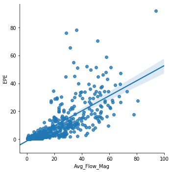

It is especially hard for this -- and any other 2-frame based motion estimator! -- model to generate accurate predictions when picture elements simply disappear out-of-frame or suddenly fly-in:

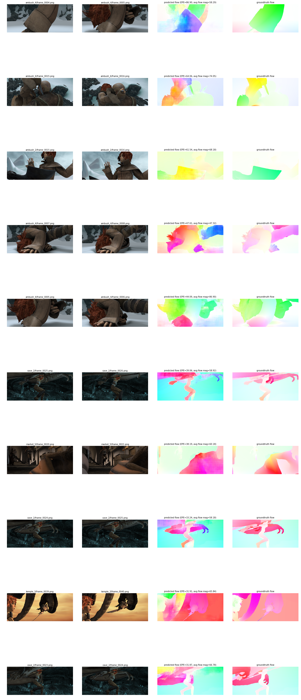

Still, when the average motion is moderate, both the small and large models generate remarkable results:

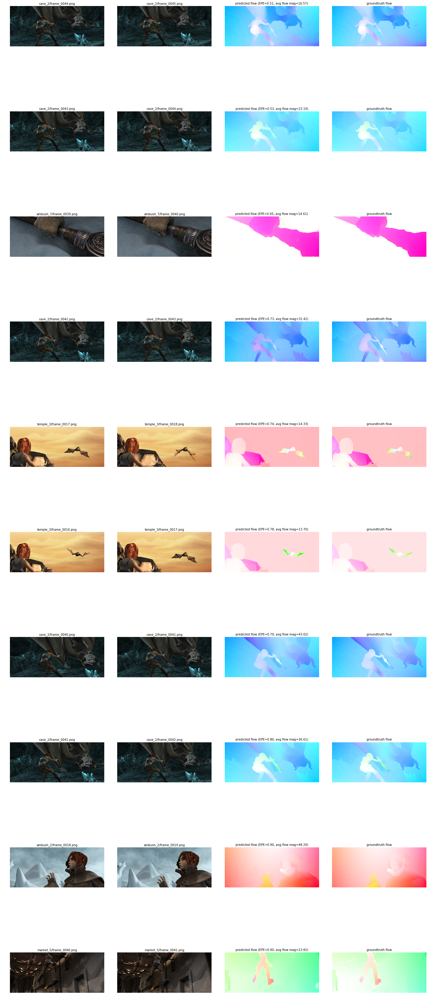

## Datasets <a name="datasets"></a>

Datasets most commonly used for optical flow estimation include:

- FlyingThings3D [[image pairs](https://lmb.informatik.uni-freiburg.de/data/SceneFlowDatasets_CVPR16/Release_april16/data/FlyingThings3D/raw_data/flyingthings3d__frames_cleanpass.tar) + [flows](https://lmb.informatik.uni-freiburg.de/data/SceneFlowDatasets_CVPR16/Release_april16/data/FlyingThings3D/derived_data/flyingthings3d__optical_flow.tar.bz2)]
- FlyingChairs [[images pairs + flows](https://lmb.informatik.uni-freiburg.de/data/FlyingChairs/FlyingChairs.zip) + [FlyingChairs_train_val split](https://lmb.informatik.uni-freiburg.de/resources/datasets/FlyingChairs/FlyingChairs_train_val.txt)]
- MPI Sintel [[zip]](http://files.is.tue.mpg.de/sintel/MPI-Sintel-complete.zip)
- KITTI Flow 2012 [[zip]](http://www.cvlibs.net/download.php?file=data_stereo_flow.zip) and/or KITTI Flow 2015 [[zip]](http://www.cvlibs.net/download.php?file=data_scene_flow.zip)

Additional optical flow datasets (not used here):

- Middlebury Optical Flow [[web]](http://vision.middlebury.edu/flow/)
- Heidelberg HD1K Flow [[web]](http://hci-benchmark.org/flow)

Per [[2018a]](#2018a), KITTI and Sintel are currently the most challenging and widely-used benchmarks for optical flow. The KITTI benchmark is targeted at autonomous driving applications and its semi-dense ground truth is collected using LIDAR. The 2012 set only consists of static scenes. The 2015 set is extended to dynamic scenes via human annotations and more challenging to existing methods because of the large motion, severe illumination changes, and occlusions. 

The Sintel benchmark is created using the open source graphics movie "Sintel" with two passes, clean and final. The final pass contains strong atmospheric effects, motion blur, and camera noise, which cause severe problems to existing methods.

## References

### 2018

- [2018a]<a name="2018a"></a> Sun et al. 2018. PWC-Net: CNNs for Optical Flow Using Pyramid, Warping, and Cost Volume. [[arXiv]](https://arxiv.org/abs/1709.02371) [[web]](http://research.nvidia.com/publication/2018-02_PWC-Net%3A-CNNs-for) [[PyTorch (Official)]](https://github.com/NVlabs/PWC-Net/tree/master/PyTorch) [[PyTorch]](https://github.com/sniklaus/pytorch-pwc) [[PyTorch]](https://github.com/RanhaoKang/PWC-Net_pytorch) [[Caffe (Official)]](https://github.com/NVlabs/PWC-Net/tree/master/Caffe) [[TensorFlow]](https://github.com/djl11/PWC_Net_TensorFlow) [[TensorFlow]](https://github.com/daigo0927/PWC-Net_tf) [[Video]](https://www.youtube.com/watch?v=vVU8XV0Ac_0) [[Video]](https://www.youtube.com/watch?v=LBJ20kxr1a0)

### 2017

- [2017a]<a name="2017a"></a> Baghaie et al. 2017. Dense Descriptors for Optical Flow Estimation: A Comparative Study. [[web]](http://www.mdpi.com/2313-433X/3/1/12)

### 2016

- [2016a]<a name="2016a"></a> Ilg et al. 2016. FlowNet 2.0: Evolution of Optical Flow Estimation with Deep Networks. [[arXiv]](https://arxiv.org/abs/1612.01925) [[PyTorch (Official)]](https://github.com/NVIDIA/flownet2-pytorch) [[TensorFlow]](https://github.com/sampepose/flownet2-tf)
- [2016b]<a name="2016b"></a> Ranjan et al. 2016. SpyNet: Optical Flow Estimation using a Spatial Pyramid Network. [[arXiv]](https://arxiv.org/abs/1611.00850) [[Torch (Official)]](https://github.com/anuragranj/spynet) [[PyTorch]](https://github.com/sniklaus/pytorch-spynet)

### 2015

- [2015a]<a name="2015a"></a> Fischer et al. 2015. FlowNet: Learning Optical Flow with Convolutional Networks. [[arXiv]](https://arxiv.org/abs/1504.06852) [[Tensorflow (FlowNet-S)]](https://github.com/DingGit/flownet-tf)

## Acknowledgments

Other TensorFlow implementations we are indebted to:
- https://github.com/daigo0927/PWC-Net_tf by daigo0927
- https://github.com/djl11/PWC_Net_TensorFlow by djl11
- https://github.com/tensorpack/tensorpack/tree/master/examples/OpticalFlow by PatWie

```
@InProceedings{Sun2018PWC-Net,
  author    = {Deqing Sun and Xiaodong Yang and Ming-Yu Liu and Jan Kautz},
  title     = {{PWC-Net}: {CNNs} for Optical Flow Using Pyramid, Warping, and Cost Volume},
  booktitle = CVPR,
  year      = {2018},
}
```

```
@InProceedings\{DFIB15,
  author       = "A. Dosovitskiy and P. Fischer and E. Ilg and P. H{\"a}usser and C. Hazirbas and V. Golkov and P. v.d. Smagt and D. Cremers and T. Brox",
  title        = "FlowNet: Learning Optical Flow with Convolutional Networks",
  booktitle    = "IEEE International Conference on Computer Vision (ICCV)",
  month        = "Dec",
  year         = "2015",
  url          = "http://lmb.informatik.uni-freiburg.de//Publications/2015/DFIB15"
}
```

# Contact Info

If you have any questions about this work, please feel free to contact us here:

[](https://www.linkedin.com/in/philferriere)
